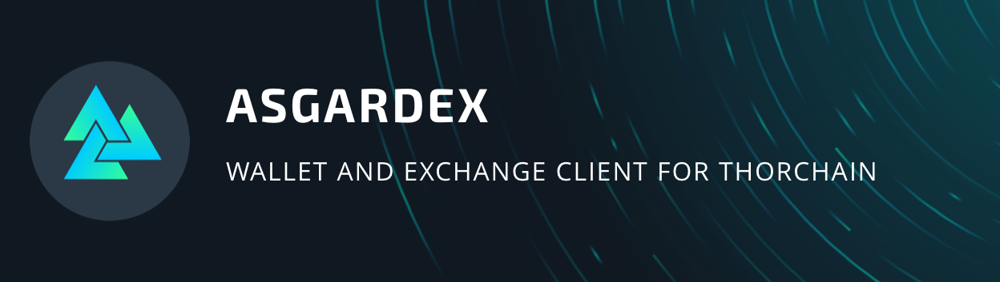
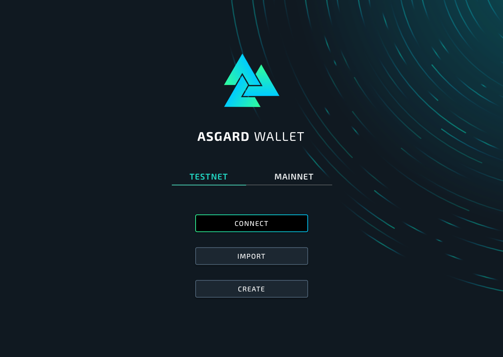

<div align="center">
  
  <br/>
  <br/>
  
</div>


## ASGARDEX uses following libraries, frameworks and more:

_(in alphabetical order)_

- [Ant Design](https://github.com/ant-design/ant-design/)
- [ESLint](https://github.com/eslint/eslint)
- [Electron](https://github.com/electron/electron/)
- [fp-ts](https://gcanti.github.io/fp-ts/)
- [Jest](https://github.com/facebook/jest)
- [Observable Hooks](https://observable-hooks.js.org/)
- [Prettier](https://github.com/prettier/prettier)
- [ReactJS](https://github.com/facebook/react/)
- [RxJS](https://rxjs.dev/)
- [Styled Components](https://styled-components.com/)
- [Testcafe](https://github.com/DevExpress/testcafe)
- [THORChain Byzantine Module](https://gitlab.com/thorchain/byzantine-module/)
- [Typescript](https://github.com/microsoft/TypeScript)
- [Vite](https://vitejs.dev)
- [xchainjs](https://github.com/xchainjs/xchainjs-lib)
- and others ...

## Install

It's recommended to use a Node version as same as Electron is running with (currently: [`Electron v16.x` / Node `16.x`](https://github.com/electron/releases#releases)). It's recommened to install [nvm](https://github.com/nvm-sh/nvm) to run correct Node version for building ASGARDEX on your machine.

```bash
git clone https://github.com/thorchain/asgardex-electron.git asgardex
cd asgardex
npm i
```

## Environment variables

While environment variables are not required (defaults are set), you can configure them. Create an `.env` file by copying all content of `.env.sample` and change these for your needs.

## Development

- Build everything needed by [`main` process](https://www.electronjs.org/docs/glossary#main-process) and by [`renderer` process](https://www.electronjs.org/docs/glossary#renderer-process) to run application in `watch` mode

```bash
npm run dev
```

In case Node might run into memory issues locally set `--max-old-space-size` as follow:

```
export NODE_OPTIONS="--max-old-space-size=4096"
```

### Generate types and endpoints for Midgard

Whenever Midgard has been updated with a new release, run following script to auto-generate types and endpoints

```bash
generate:types
```

Generated files are based on Midgard's [swagger.json](https://midgard.thorchain.info/v2/swagger.json).

### Generate ERC20 asset white list

Whenever [THORChain ERC20 asset whitelist](https://gitlab.com/thorchain/thornode/-/blob/develop/bifrost/pkg/chainclients/ethereum/token_list.json) has been updated (usually with a [new release of THORNode](https://gitlab.com/thorchain/thornode/-/tags)), run following script to auto-generate this list for ASGARDEX

```bash
npm run generate:erc20whitelist
```

### How to auto-unlock a locked wallet while hot-reloading the app (for development only, disabled in production build)

Use `REACT_APP_WALLET_PASSWORD` to run the app by replacing `password` with your own password

```bash
REACT_APP_WALLET_PASSWORD=password npm run dev
```

Or add to `REACT_APP_WALLET_PASSWORD=password` to `.env` file and run `npm run dev`

### How to enable (more) chains for development

Add chains you want to have for development to `REACT_APP_CHAINS_ENABLED`, for example

```bash
REACT_APP_CHAINS_ENABLED=THOR,BNB,BTC,ETH,LTC
```

Note: String of chains have to be as same as [definitions in xchain-util](https://github.com/xchainjs/xchainjs-lib/blob/master/packages/xchain-util/src/chain.const.ts)

## Tests

### `unit`

```bash
npm run test
```

### `e2e`

**Note:** e2e tests are disabled temporary (see #750)

```bash
npm run test:e2e
```

### `lint`

```bash
npm run lint
```

Note: `eslint` is provided by `react-scripts` located in `./node_modules/react-scripts/node_modules/` and don't need to be extra installed. If your editor has some issues to find `eslint`, you might point it to this location (see [VSCode settings file](.vscode/settings.json) as an example).

### Auto updates

To check locally if auto-update works correctly create `dev-app-update.yml` file at the root
directory with a content based on [dev-app-update.sample.yml](./dev-app-update.sample.yml) with providing
your GutHub personal access token. After that just play locally with version provided by `package.json`

## Folder structure

### `src`

```bash
src
├── index.ts # entry point for CRA
├── main # sources of Electron's main process
├── renderer # sources of Electron's renderer process (aka webapp)
└── shared # shared sources for Electron's main and renderer processes
```

### `src/main` (Electron's "main" app)

```bash
src/main
├── electron.ts # entry point
├── i18n # internationalization (needed for menus)
└── menu # "native" menus
```

### `src/renderer` (Electron's "renderer" app aka ReactJS webapp)

```bash
src/renderer
├── assets # static files (svg, fonts etc.)
├── components # basic components
├── contexts # React contexts to provide "global" accessible states (RxJS based)
├── helpers # helper functions
├── hooks # custom hooks
├── i18n # internationalization (translations etc.)
├── index.tsx # entry point
├── routes # routing
├── services # RxJS based IO handler and states (consumed by contexts)
├── types # TypeScript types (e.g. generated types for Midgard API)
└── views # "Container" components
```

## Security

ASGARDEX follows [security recommendation made by Electron team](https://www.electronjs.org/docs/tutorial/security), such as:

- [Disable the Node.js integration in renderers that display remote content](https://www.electronjs.org/docs/tutorial/security#2-do-not-enable-nodejs-integration-for-remote-content)
- [Enable context isolation in renderers that display remote content](https://www.electronjs.org/docs/tutorial/security#3-enable-context-isolation-for-remote-content)
- [Expose IPC-based APIs to provide one method per IPC message](https://www.electronjs.org/docs/tutorial/context-isolation#security-considerations)
- [Disable the remote module](https://www.electronjs.org/docs/tutorial/security#15-disable-the-remote-module)
- [Do not use openExternal with untrusted content](https://www.electronjs.org/docs/tutorial/security#14-do-not-use-openexternal-with-untrusted-content). Provided hostnames are defined in [`EXTERNALS_WHITELIST`](./src/main/api/url.ts), all others are blocked. This list has to be extended if needed.
- [Use a current version of Electron](https://www.electronjs.org/docs/tutorial/security#17-use-a-current-version-of-electron)

## Packaging

**Important note** for `macOS` users: Please follow guide of ["How to package `ASGARDEX` on macOS"](./PACKAGE_MACOS.md) before running following command.

```
npm run package:electron
```

## Keystore

By creating a new wallet or importing an existing one, ASGARDEX is saving wallet's phrase encrypted in `keystore.json` on your machine in [Electron's `appData` folder](https://www.electronjs.org/docs/api/app#appgetpathname) at following location:

### Windows

```bash
# ASGARDEX installed from *.exe
%APPDATA%/ASGARDEX/storage/keystore.json
# ASGARDEX built and run locally
%APPDATA%/Electron/storage/keystore.json
```

### macOS

```bash
# ASGARDEX installed from *.dmg
~/Library/Application Support/ASGARDEX/storage/keystore.json
# ASGARDEX built and run locally
~/Library/Application Support/Electron/storage/keystore.json
```

### Linux

```bash
# ASGARDEX installed from *.deb
~/.config/ASGARDEX/storage/keystore.json
# ASGARDEX built and run locally
~/.config/Electron/storage/keystore.json
```

`keystore.json` can be removed in ASGARDEX by clicking "Remove wallet" in `Wallet -> Settings` or by removing it manually.

## Git branching workflow

See [BRANCHING_WORKFLOW.md](./BRANCHING_WORKFLOW.md)

## Releasing

See [RELEASE.md](./RELEASE.md)

## Docs

See the [docs and guides here](https://docs.thorchain.org)

## Contributing

Everyone is welcome to contribute. Check [open issues](https://github.com/thorchain/asgardex-electron/issues) or create a new one to start your work with and open a PR afterwards. Newcomers might want to check issues labeled as [good first issues](https://github.com/thorchain/asgardex-electron/labels/good%20first%20issue).

## Bug Reports

Please use [bug report template](https://github.com/thorchain/asgardex-electron/issues/new?assignees=&labels=bug&template=2-Bug_report.md) to file any bugs.

## License

MIT [THORChain](https://github.com/thorchain)
