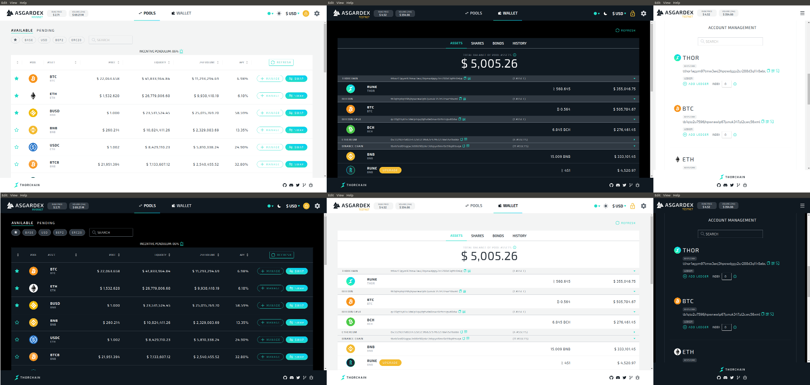

<div align="center">
  
  <br/>
  <br/>
  
</div>


## ASGARDEX uses following libraries, frameworks and more:

_(in alphabetical order)_

- [Ant Design](https://github.com/ant-design/ant-design/)
- [Create React App](https://github.com/facebook/create-react-app)
- [ESLint](https://github.com/eslint/eslint)
- [Electron](https://github.com/electron/electron/)
- [fp-ts](https://gcanti.github.io/fp-ts/)
- [Jest](https://github.com/facebook/jest)
- [Observable Hooks](https://observable-hooks.js.org/)
- [Prettier](https://github.com/prettier/prettier)
- [ReactJS](https://github.com/facebook/react/)
- [Styled Components](https://styled-components.com/)
- [Testcafe](https://github.com/DevExpress/testcafe)
- [THORChain Byzantine Module](https://gitlab.com/thorchain/byzantine-module/)
- [RxJS](https://rxjs.dev/)
- [Typescript](https://github.com/microsoft/TypeScript)
- and others ...

## Install

It's recommended to use a Node version as same as Electron is running with (currently: [`Electron v9.1.2` / Node `12.14.1`](https://github.com/electron/releases#releases))

```bash
git clone https://github.com/thorchain/asgardex-electron.git asgardex
cd asgardex
yarn
```

## Environment variables

While environment variables are not required (defaults are set), you can configure them. Create an `.env` file by copying all content of `.env.sample` and change these for your needs.

## Development

```bash
yarn dev
```

### How to auto-unlock a locked wallet while hot-reloading the app (for development only, disabled in production build)

Use `REACT_APP_WALLET_PASSWORD` to run the app by replacing `password` with your own password

```bash
REACT_APP_WALLET_PASSWORD=password yarn dev
```

Or add to `REACT_APP_WALLET_PASSWORD=password` to `.env` file and run `yarn dev`

## Tests

### `unit`

```bash
yarn test
```

### `e2e`

```bash
yarn test:e2e
```

## Folder structure

### `src`

```bash
src
├── index.ts # entry point for CRA
├── main # sources of Electron's main process
├── renderer # sources of Electron's renderer process (aka webapp)
└── shared # shared sources for Electron's main and renderer processes
```

### `src/main` (Electron's "main" app)

```bash
src/main
├── electron.ts # entry point
├── i18n # internationalization (needed for menus)
└── menu # "native" menus
```

### `src/renderer` (Electron's "renderer" app aka ReactJS webapp)

```bash
src/renderer
├── assets # static files (svg, fonts etc.)
├── components # basic components
├── contexts # React contexts to provide "global" accessible states (RxJS based)
├── helpers # helper functions
├── hooks # custom hooks
├── i18n # internationalization (translations etc.)
├── index.tsx # entry point
├── routes # routing
├── services # RxJS based IO handler and states (consumed by contexts)
├── types # TypeScript types (e.g. generated types for Midgard API)
└── views # "Container" components
```

## Packaging

**Important note** for `macOS` users: Please follow guide of ["How to package `ASGARDEX` on macOS"](./PACKAGE_MACOS.md) before running following command.

```
yarn package:electron
```

## Keystore

By creating a new wallet or importing an existing one, ASGARDEX is saving wallet's phrase encrypted in `keystore.json` on your machine in [Electron's `appData` folder](https://www.electronjs.org/docs/api/app#appgetpathname) at following location:

### Windows

```bash
# ASGARDEX installed from *.exe
%APPDATA%/ASGARDEX/storage/keystore.json
# ASGARDEX built and run locally
%APPDATA%/Electron/storage/keystore.json
```

### macOS

```bash
# ASGARDEX installed from *.dmg
~/Library/Application Support/ASGARDEX/storage/keystore.json
# ASGARDEX built and run locally
~/Library/Application Support/Electron/storage/keystore.json
```

### Linux

```bash
# ASGARDEX installed from *.deb
~/.config/ASGARDEX/storage/keystore.json
# ASGARDEX built and run locally
~/.config/Electron/storage/keystore.json
```

`keystore.json` can be removed in ASGARDEX by clicking "Remove wallet" in `Wallet -> Settings` or by removing it manually.

## Releasing

See [RELEASE.md](./RELEASE.md)

## Docs

See the [docs and guides here](https://docs.thorchain.org)

## Contributing

Please see the Contributing Guidelines here (_coming soon_).

## Bug Reports

Please see the Bug Report Process here (_coming soon_).

## License

MIT [THORChain](https://github.com/thorchain)
